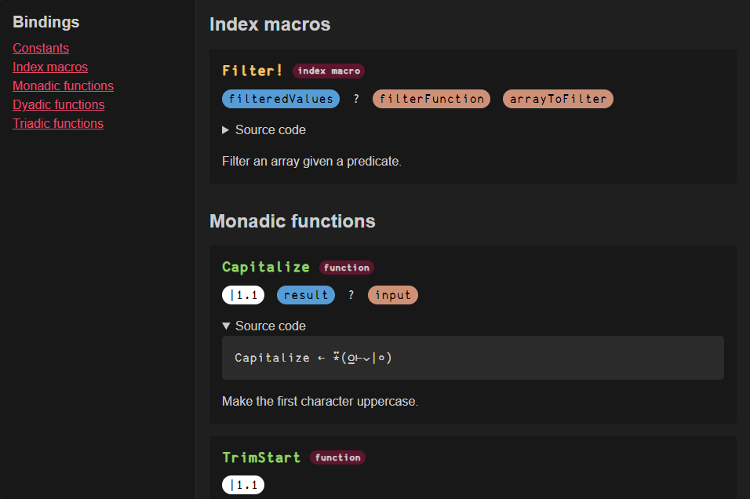

# uiua doc gen

This is a command line tool to generate documentation from your [Uiua](https://uiua.org/) libraries.



# Limitations

This tool is still in development and has some limitations:
- Only the declarations in `lib.ua` files are considered. If you import bindings from other files, they will not be displayed in this version.
- There's only one theme available for the generated documentation.
- Can not embed images yet.

# Prerequisites

- You need to have [Rust](https://www.rust-lang.org/) installed in your system.
- Your library must have a single `lib.ua` file in the root of the project with all the declarations.

# Usage
1. Install the package globally:
    ```bash
    cargo install uiua-doc-gen
    ```

2. Open a terminal in the root of your Uiua project and run:
    ```bash
    uiua-doc-gen --name project-name
    ```
   
3. The documentation will be generated in the `doc-site` folder.

# Hosting on GitHub Pages

The generated website is a static site, so you can host it on GitHub Pages. To do that, follow the steps in the [uiua-doc-gen-action repository](https://github.com/ekgame/uiua-doc-gen-action).